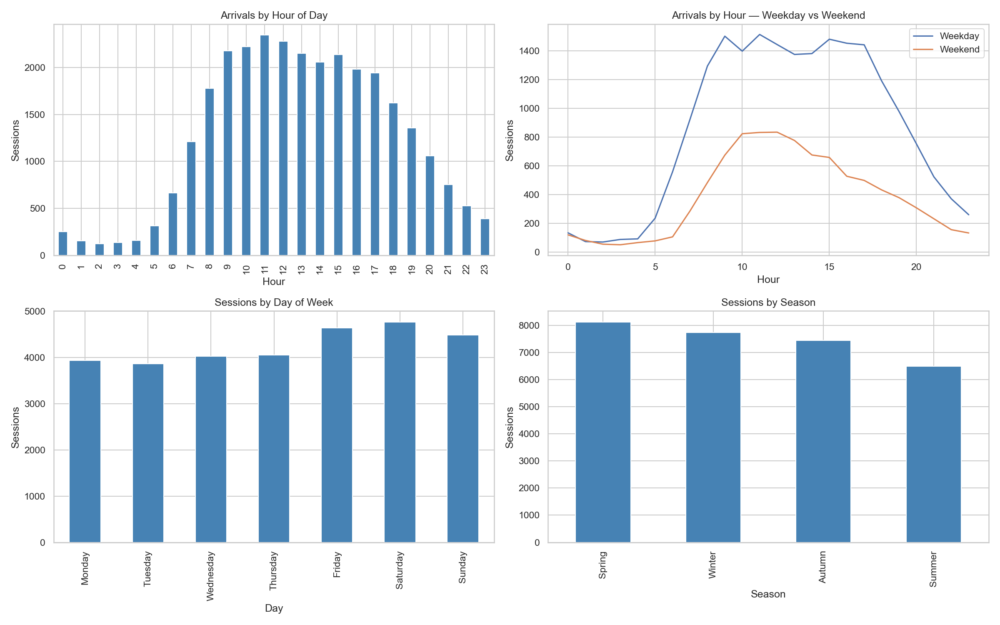
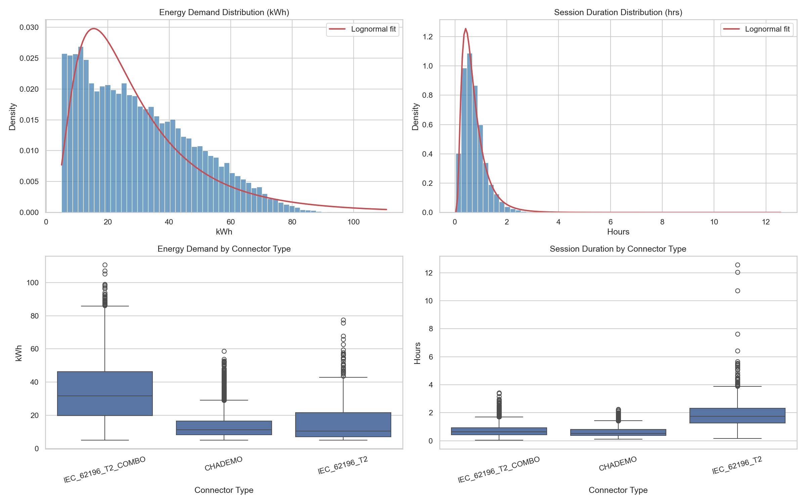
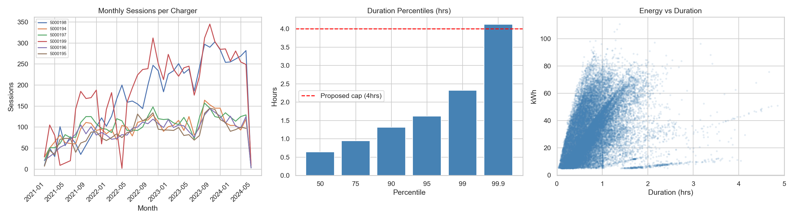

# An AI-Enabled Digital Twin for EV Charging: Behavioural Simulation, Policy Evaluation, and Pricing Optimisation

**MSc Data Science - Interim Report | CSC8639**

| | |
|---|---|
| Author | Hoang Nguyen Lai |
| Primary Supervisor | Dr Jichun Li, School of Computing, Newcastle University |
| Project Proposer | Dr Sanchari Deb, School of Engineering, Newcastle University |
| Date | May 2026 |

---

## 1. Introduction

The rapid global adoption of electric vehicles (EVs) represents one of the most consequential transitions in modern transportation infrastructure. The International Energy Agency reported that global EV stock surpassed 40 million vehicles in 2023, with projections indicating EVs could constitute over one-third of new vehicle sales by 2030 [CITE: IEA Global EV Outlook 2024]. In the United Kingdom, the government's Net Zero Strategy mandates the phase-out of new petrol and diesel vehicle sales by 2035, placing EV charging infrastructure at the centre of national decarbonisation policy [CITE: UK Net Zero Strategy 2021].

The growth of EV adoption introduces significant operational challenges for charging networks. Demand is inherently heterogeneous, shaped by driver behaviour, time-of-day patterns, connector type preferences, and real-time grid carbon intensity. Static or rule-based approaches to charging management are poorly suited to this complexity, as they cannot adapt to dynamic demand, varying price signals, or grid constraints [CITE: Paper 5].

Digital twins - computational replicas of physical systems calibrated to reproduce real-world behaviour - have emerged as a promising paradigm for addressing these challenges. When implemented as agent-based simulations and calibrated on real historical data, digital twins allow policymakers to test interventions before deployment, without disrupting live infrastructure [CITE: Paper 2]. Agent-based modelling (ABM) is particularly well-suited to EV charging contexts, as heterogeneous driver agents can make autonomous decisions based on energy need, cost sensitivity, and station availability [CITE: Paper 1].

Despite this potential, few studies have grounded digital twin simulations in real institutional charging data, and fewer still have applied reinforcement learning (RL) to autonomously discover optimal pricing policies. This project addresses both gaps by building a fully calibrated, AI-enabled digital twin of the EV charging network at Newcastle University's Urban Sciences Building (USB), using 29,775 real historical charging sessions spanning 2021 to 2024.

---

## 2. Aim and Objectives

### 2.1 Aim

This project aims to develop, calibrate, and evaluate an AI-enabled agent-based digital twin of the EV charging network at Newcastle University's Urban Sciences Building, using real historical session data to simulate heterogeneous charging behaviour, evaluate policy interventions under realistic uncertainty, and optimise pricing and incentive strategies for grid resilience and carbon reduction.

### 2.2 Objectives

1. To construct a reproducible data engineering pipeline that extracts, validates, and stores historical EV charging session data from the USB charging network - comprising 29,775 sessions across six chargers from March 2021 to July 2024 - in a portable analytical database suitable for simulation calibration and downstream analysis.

2. To conduct a comprehensive exploratory data analysis of the charging session dataset, fitting statistical distributions to empirical charging behaviour including hourly arrival patterns, energy demand, session duration, and connector type preferences, and storing calibration parameters for use in the agent-based simulation.

3. To implement a calibrated agent-based simulation using the Mesa framework, in which heterogeneous EV driver agents reproduce key statistical properties of the historical dataset - including arrival distributions, energy demand, session duration, and charger utilisation - within a defined tolerance threshold.

4. To develop a scenario engine that stress-tests three policy interventions against the baseline simulation: EV adoption growth via scaled arrival rates; time-of-use (ToU) pricing via hour-varying price signals; and carbon-aware incentives via penalties on high-carbon charging periods - evaluating outcomes across four KPIs: grid load, station utilisation, average waiting time, and CO2 emissions.

5. To produce a quantitative policy evaluation report comparing baseline and intervention scenarios across all KPIs, with statistical analysis across multiple simulation runs to account for stochastic variability.

6. (Extension) To implement a reinforcement learning policy optimisation module using Proximal Policy Optimisation (PPO) via Stable-Baselines3, wrapping the Mesa simulation as a Gymnasium-compatible environment, and demonstrating that the learned pricing policy outperforms handcrafted rules across the defined KPI set.

---

## 3. Overview of Progress

### 3.1 Literature Review

A targeted review of five papers has been conducted to ground the project methodology in current research. Papers span multi-agent EV charging simulation, digital twin frameworks for EV infrastructure, grid-integrated demand response, smart meter analytics for building energy benchmarking, and edge-AI reinforcement learning optimisation.

| Paper | Key Contribution | Relevance |
|---|---|---|
| Multi-Agent Game-Theoretic Model [1] | Utility-based EV agent with SOC urgency; dynamic pricing reduces peak congestion | Informs agent decision model and ToU pricing scenario |
| Digital Twin for EV Infrastructure [2] | ABM with PSO optimisation and GIS integration on a campus network | Validates Mesa as simulation framework; scenario engine design |
| Grid-Integrated DT Framework [3] | CPO incentive optimisation and demand response KPIs | Informs KPI selection: grid load, waiting time, CO2 |
| Smart City DT for Building Energy [4] | Smart meter analytics and temporally-segmented benchmarking | Informs data pipeline design and metering data investigation |
| Edge-AI RL + AHP Framework [5] | RL with multi-criteria decision making; 23.5% wait time reduction reported | Motivates RL extension; AHP approach for multi-objective KPI weighting |

### 3.2 Data Engineering Pipeline

A complete, modular data engineering pipeline has been implemented in Python across four files: `ingestion/config.py`, `ingestion/storage.py`, `ingestion/scraper.py`, and `ingestion/run_scraper.py`. The pipeline extracts 30-minute interval energy data from Newcastle University's metering portal using authenticated POST requests, with parallel execution via `ThreadPoolExecutor` and a DuckDB-backed checkpoint table enabling fault-tolerant, resumable scraping.

All project data is stored in a single portable DuckDB analytical database (`ev_twin.duckdb`), which contains the following tables:

| Table | Rows | Source | Purpose |
|---|---|---|---|
| `charging_sessions` | 29,775 | Supervisor CSV | Primary simulation calibration data |
| `metering_raw` | 28,728,144 | NCL metering portal (scraped) | Building energy data - investigated for integration |
| `simulation_params` | 7 parameter sets | Derived from EDA | Agent calibration parameters for Mesa simulation |
| `scrape_checkpoint` | 598,596 | System-generated | Fault-tolerant resume mechanism |

Source code is version-controlled at: [https://github.com/NguyenIslandBoy/ev-digital-twin](https://github.com/NguyenIslandBoy/ev-digital-twin)

### 3.3 Metering Data Investigation

To assess whether building switchboard meter data (`USB_E_SwitchMA` and `USB_E_SwitchMB`) could be integrated with charging session data for grid load validation, a systematic data quality investigation was conducted. Charging sessions were aggregated to 30-minute windows and joined on timestamp across 57,696 matched intervals.

Two critical findings emerged. First, the Pearson correlation between aggregated session energy and switchboard meter readings was -0.086, indicating no meaningful relationship. Second, monthly analysis of distinct meter values per interval revealed that 34 of 40 months contained a single repeated value across all 48 daily slots - indicative of metering system collection failures rather than genuine interval consumption data. Only 6 months yielded real interval-level readings, representing less than 15% of the study period. This was confirmed by the project proposer, who verified these are the only meters capturing EV-related load in the USB building.

**Decision:** `usb_merged_final_data.csv` is used as the sole data source. Grid load KPIs will be derived from simulation output rather than real meter readings. The metering investigation is documented as a data quality finding demonstrating analytical rigour.

### 3.4 Exploratory Data Analysis

A comprehensive EDA was conducted on 29,775 charging sessions in `notebooks/01_eda.ipynb`. Key findings that directly inform agent behaviour parameters are summarised below.

| Finding | Detail | Simulation Implication |
|---|---|---|
| Bimodal arrival pattern | Peaks at 11:00-12:00 and 14:00-16:00, matching lecture schedule | Empirical hourly arrival rates used; Poisson sampling per hour |
| Weekday vs weekend split | 68.93% weekday sessions; weekend peak shifts to 10:00-11:00 | Separate arrival distributions by day type |
| Connector type distribution | IEC_62196_T2_COMBO: 82.07%, CHADEMO: 14.32%, IEC_62196_T2: 3.61% | Categorical sampling per agent |
| Energy distribution | Mean 30.4 kWh; flat plateau 5-20 kWh; lognormal fit poor | Empirical sampling per connector type |
| Duration distribution | Lognormal fit confirmed; median 0.64 hrs; capped at 4 hrs (99.9th percentile) | Lognormal sampling per connector type |
| Charger utilisation | 6 chargers; 5000198 and 5000199 handle ~48% of sessions | Per-charger capacity modelled explicitly |
| Seasonal pattern | Spring highest, Summer lowest (term-time effect) | Season-aware arrival scaling in scenario engine |

### 3.5 Key Design Decisions

| Decision | Choice | Justification |
|---|---|---|
| Storage | DuckDB | Zero server setup, columnar analytics, portable, native pandas integration |
| Simulation framework | Mesa | Python-native ABM, appropriate for 6-charger network scale, reproducible |
| Energy demand modelling | Empirical sampling per connector type | Lognormal fit visually poor; flat plateau 5-20 kWh indicates mixture distribution |
| Duration modelling | Lognormal per connector type (AIC-selected vs Gamma) | Visual fit confirmed; separate params per connector captures behavioural heterogeneity |
| Metering integration | Not integrated | Systemic collection failures in 34/40 months; near-zero correlation; confirmed by supervisor |
| RL framework | Stable-Baselines3 PPO on Google Colab | Production-grade library; PPO stable for continuous action spaces; Colab A100 for compute |

---

## 4. Project Plan

### 4.1 Phases and Timeline

| Phase | Key Tasks | Objectives | Target |
|---|---|---|---|
| Phase 1: Data Engineering | Pipeline, DuckDB storage, metering investigation, EDA | O1, O2 | Complete (May 2026) |
| Phase 2: Mesa Simulation | Agent design, charger resource model, calibration validation | O3 | June 2026 |
| Phase 3: Scenario Engine | ToU pricing, EV adoption growth, carbon incentive scenarios, KPI evaluation | O4, O5 | Mid July 2026 |
| Phase 4: RL Extension | Gym environment wrapper, PPO training on Colab, policy comparison | O6 | Late July 2026 |
| Phase 5: Writing and Submission | Dissertation, source code cleanup, documentation | All | 10 Aug 2026 |
| Phase 6: Presentation | Poster design and submission, oral presentation preparation | All | 13 Aug 2026 |

### 4.2 Milestones

| Date | Milestone |
|---|---|
| 5 June 2026 | Interim report submitted |
| 30 June 2026 | Calibrated Mesa simulation validated against historical data |
| 20 July 2026 | All three what-if scenarios evaluated with KPI report |
| 29 July 2026 | Research poster submitted (10 pts) |
| 10 August 2026 | Dissertation and source code submitted |
| 13 August 2026 | Oral presentation evidence submitted |

### 4.3 Gantt Chart

*Grant chart is being created*

| Task | Jun | | Jul | | | Aug | |
|---|:---:|:---:|:---:|:---:|:---:|:---:|:---:|
| | W1-2 | W3-4 | W1 | W2 | W3-4 | W1-2 | W3 |
| **Phase 1: Data Engineering** | | | | | | | |
| Data pipeline and DuckDB storage | done | | | | | | |
| Metering data investigation | done | | | | | | |
| Exploratory data analysis | done | | | | | | |
| **Phase 2: Mesa Simulation** | | | | | | | |
| Mesa agent and charger design | active | active | | | | | |
| Simulation calibration and validation | | active | active | | | | |
| **Milestone: Calibrated simulation** | | | M2 | | | | |
| **Phase 3: Scenario Engine** | | | | | | | |
| ToU pricing scenario | | | | active | | | |
| EV adoption growth scenario | | | | active | | | |
| Carbon-aware incentives scenario | | | | active | | | |
| KPI evaluation and comparison | | | | | active | | |
| **Milestone: Scenario engine complete** | | | | | M3 | | |
| **Phase 4: RL Extension** | | | | | | | |
| Gym environment wrapper | | | | | active | | |
| PPO training on Colab | | | | | active | | |
| Policy comparison and evaluation | | | | | active | | |
| **Phase 5: Writing** | | | | | | | |
| Dissertation writing | | active | active | active | active | active | |
| Source code cleanup and docs | | | | | active | active | |
| Poster design | | | | | active | | |
| **Milestone: Poster due (29 Jul)** | | | | | M4 | | |
| **Milestone: Dissertation due (10 Aug)** | | | | | | M5 | |
| Oral presentation preparation | | | | | | active | active |
| **Milestone: Oral presentation (13 Aug)** | | | | | | | M6 |

### 4.4 Risks

| Risk | Likelihood | Impact | Mitigation |
|---|---|---|---|
| Mesa simulation fails to calibrate within tolerance | Medium | High | Use KS-test for distribution comparison; fall back to empirical session replay if needed |
| RL agent fails to converge | Medium | Medium | RL is an extension; core deliverable is the scenario engine; reduce state space if needed |
| Dissertation writing underestimated | High | High | Budget 5 weeks minimum; begin writing in parallel with simulation development in June |
| Session cookie expiry during scrape | Low | Low | Checkpoint table enables resume; scrape is already complete |

---

## 5. Data Management Plan

### 5.1 Data Description

| Data | Source | Format | Size | Sensitive? |
|---|---|---|---|---|
| Charging sessions | Dr Sanchari Deb (supervisor) | CSV | 29,775 rows, ~4 MB | No - auth IDs are anonymised integers |
| Building metering data | NCL metering portal (scraped) | DuckDB | 28.7M rows, ~400 MB | No - institutional energy readings |
| Simulation parameters | Derived from EDA | DuckDB / JSON | < 1 MB | No |
| Python source code | Student-created | .py files | < 1 MB | No |
| Jupyter notebooks | Student-created | .ipynb files | < 5 MB | No |
| Trained RL model weights | Student-created (Colab) | .zip (SB3 format) | < 50 MB | No |

### 5.2 Data Collection and Quality

The charging session dataset was provided directly by the project proposer and is treated as the authoritative source. No modifications are made to the raw CSV file; all transformations are applied at load time via DuckDB SQL and documented in the project README and EDA notebook.

Building metering data was collected via an automated Python scraper using authenticated POST requests to the university metering portal. A checkpoint table in DuckDB records the status of every (meter_id, date) pair scraped, providing full audit coverage of 598,596 requests. Data quality issues identified during the metering investigation are documented in the EDA notebook with supporting SQL queries and correlation analysis.

### 5.3 Storage and Backup

All code and notebooks are version-controlled in a private GitHub repository: [https://github.com/NguyenIslandBoy/ev-digital-twin](https://github.com/NguyenIslandBoy/ev-digital-twin)

Raw data and the DuckDB database are excluded from the repository via `.gitignore` due to file size and institutional data considerations. Storage locations are as follows:

| Asset | Primary Location | Backup |
|---|---|---|
| Source code and notebooks | GitHub (private) | Local machine |
| Raw CSV dataset | Local machine (`data/raw/`) | University OneDrive (code folder only) |
| DuckDB database | Local machine (`data/`) | External drive (weekly) |
| Trained model weights | Google Colab / Drive | Local machine after training |

### 5.4 Ethics, Privacy, and Legal Compliance

This project does not involve human participants, surveys, interviews, or the collection of personal data. Charging session auth IDs are anonymised integer identifiers with no linkage to named individuals. The dataset was provided by the project proposer under institutional data sharing. Building metering data is institutional infrastructure data with no personal identifiers.

Ethical approval has been sought via the Newcastle University ethics portal as required by CSC8639. The project is classified as low-risk: no personal data, no human participants, no data collected outside the UK or EEA, and no commercially sensitive information.

### 5.5 Reproducibility and Sharing

The project is designed for full reproducibility from raw data to final outputs:

- `requirements.txt` and `pyproject.toml` document all Python dependencies
- `README.md` documents environment setup and execution steps
- All notebooks are structured to run sequentially from DuckDB to final plots
- After dissertation submission, the GitHub repository will be made public
- Raw charging session data will not be shared publicly without supervisor approval
- Trained RL model weights will be included in the repository if file size permits

### 5.6 Retention and Deletion

All project data will be retained until dissertation assessment is confirmed complete, in accordance with Newcastle University's Research Data Management Policy. No personal data requiring scheduled deletion is held. After submission, the public GitHub repository will remain accessible indefinitely. Local copies of the database and raw data will be retained for a minimum of 12 months post-submission.

---

## References

[1] [Author(s)], "Multi-Agent Game-Theoretic Modelling of Electric Vehicle Charging Behavior and Pricing Optimization in Dynamic Ecosystems," *Procedia Computer Science*, 2025. Available: https://www.sciencedirect.com/science/article/pii/S1877050925007963

[2] [Author(s)], "A Digital Twin Framework for Decision-Support and Optimization of EV Charging Infrastructure in Localized Urban Systems," *arXiv*, 2025. Available: https://arxiv.org/abs/2510.24758

[3] [Author(s)], "Digital Twin System Framework and Implementation for Grid-Integrated Electric Vehicles," [Journal], [Year]. Available: https://ieeexplore.ieee.org/document/11040586

[4] [Author(s)], "Smart City Digital Twin-Enabled Energy Management: Toward Real-Time Urban Building Energy Benchmarking," [Journal], [Year]. Available: https://shorturl.at/KjQO1

[5] [Author(s)], "Edge-AI Based Multi-Criteria Optimisation Framework for Dynamic EV Charging with Real-Time Grid Load, Traffic, and User Behavior Integration," *Computing*, 2025. Available: https://link.springer.com/article/10.1007/s00607-025-01531-x

[6] IEA, *Global EV Outlook 2024*. International Energy Agency, Paris, 2024. Available: https://www.iea.org/reports/global-ev-outlook-2024

[7] HM Government, *Net Zero Strategy: Build Back Greener*. Department for Business, Energy and Industrial Strategy, London, 2021.

[8] J. Kazil, D. Masad, and A. Crooks, "Utilizing Python for Agent-Based Modeling: The Mesa Framework," in *Social, Cultural, and Behavioral Modeling*, Springer, 2020.

[9] A. Raffin, A. Hill, A. Gleave, A. Kanervisto, M. Ernestus, and N. Dormann, "Stable-Baselines3: Reliable Reinforcement Learning Implementations," *Journal of Machine Learning Research*, vol. 22, no. 268, pp. 1-8, 2021.

*Need to add more references*
